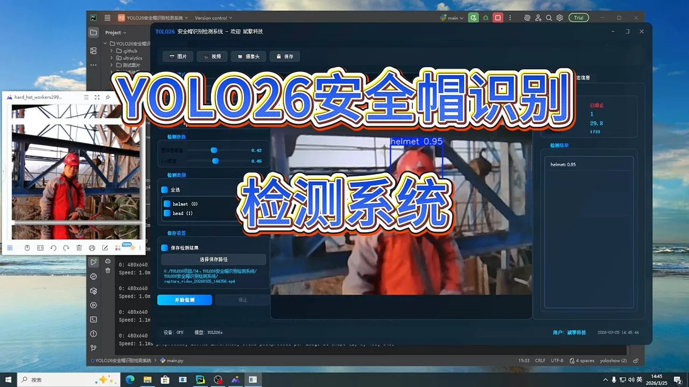
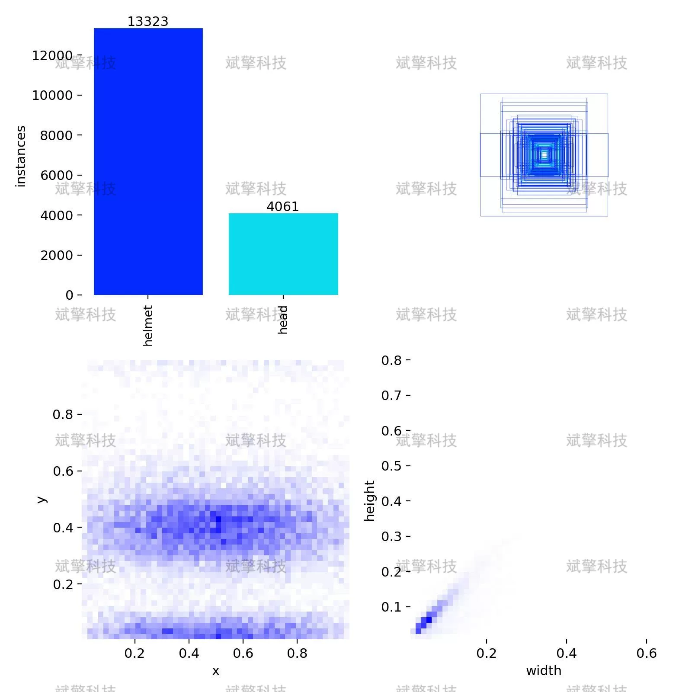
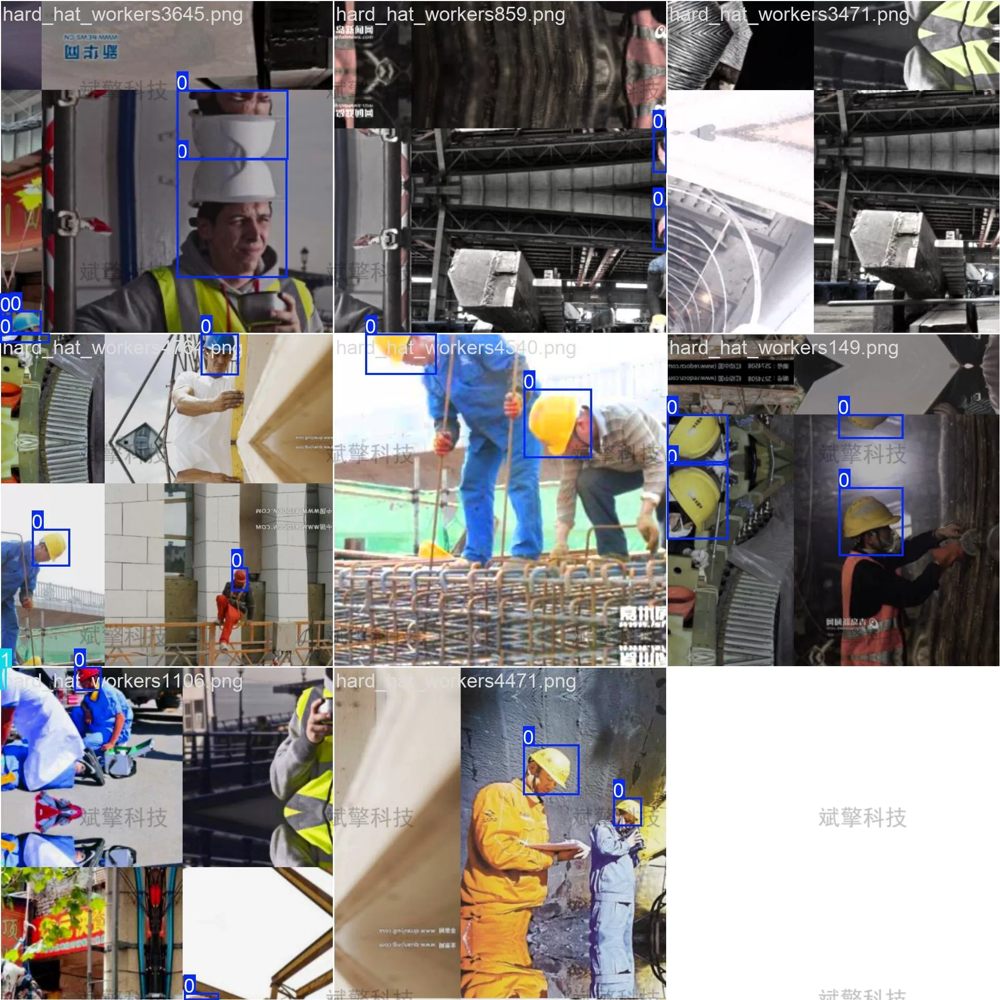
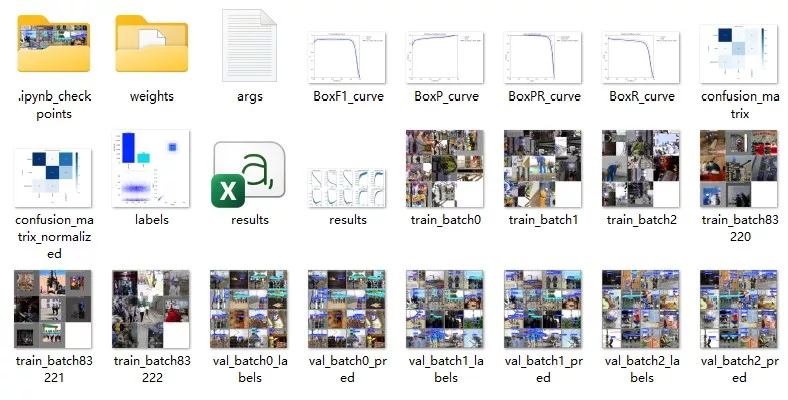
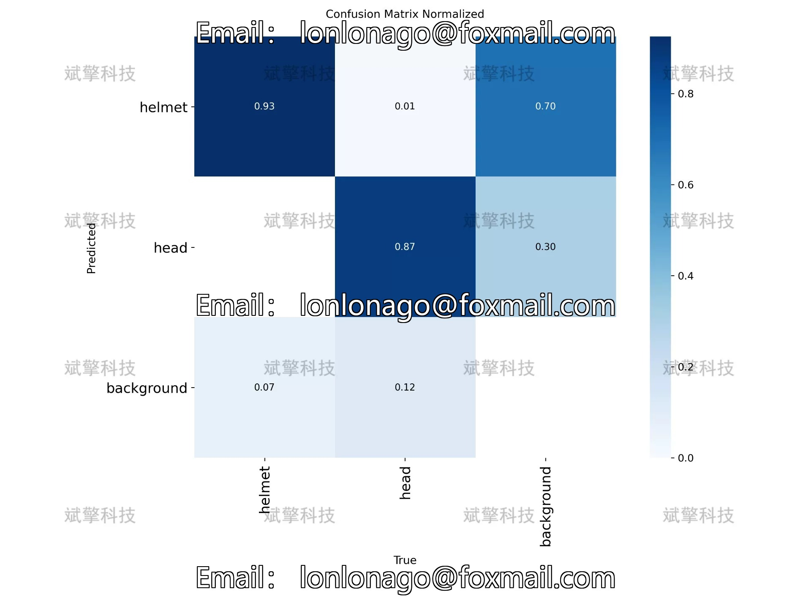
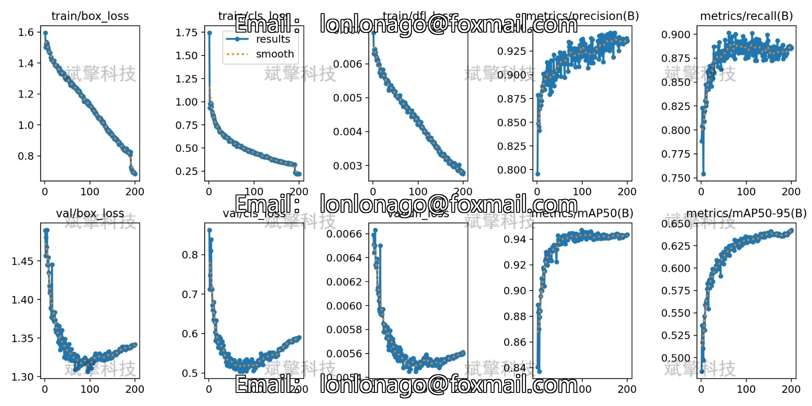
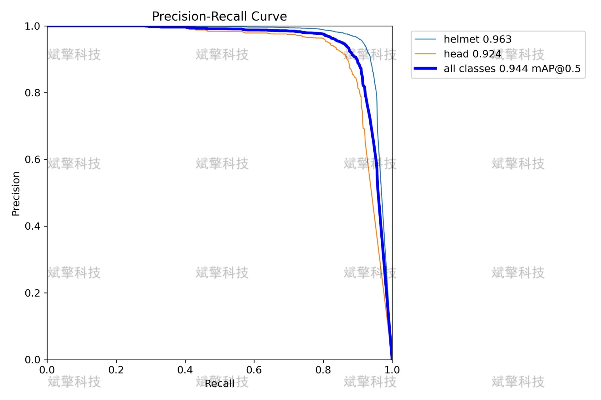
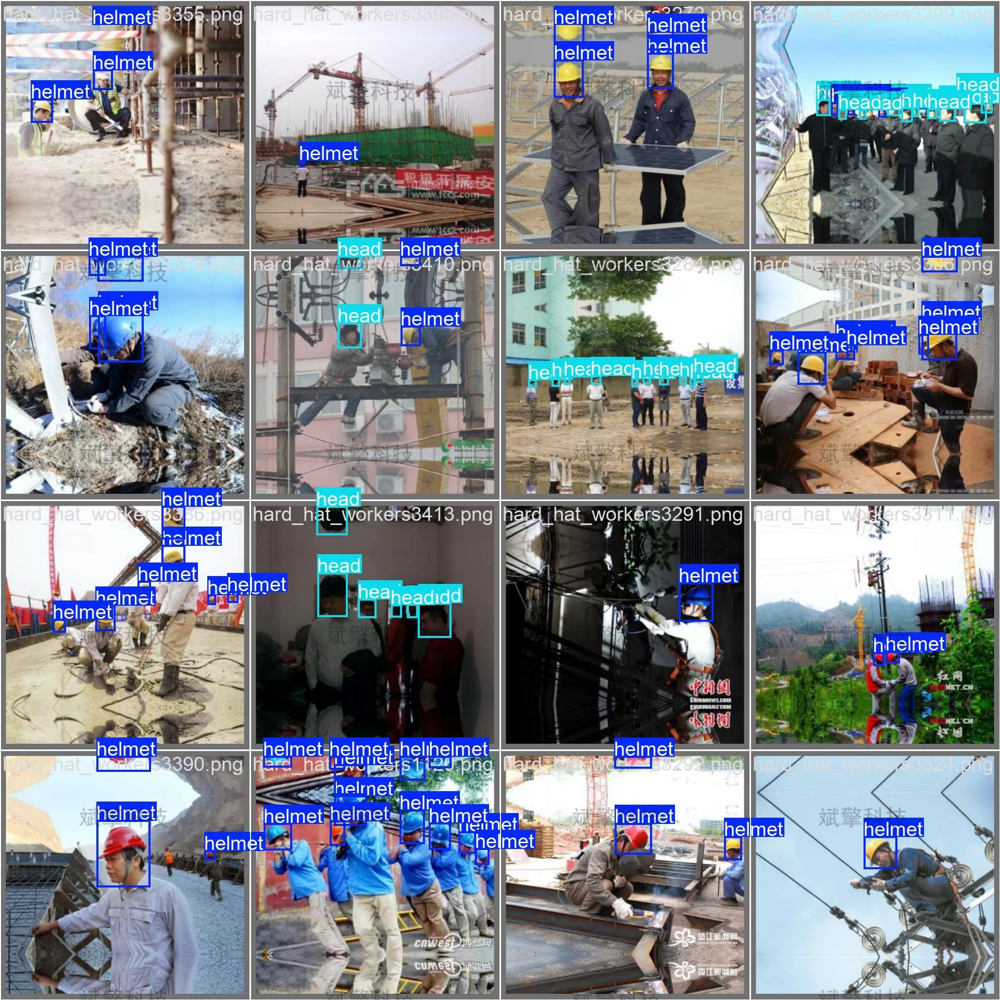
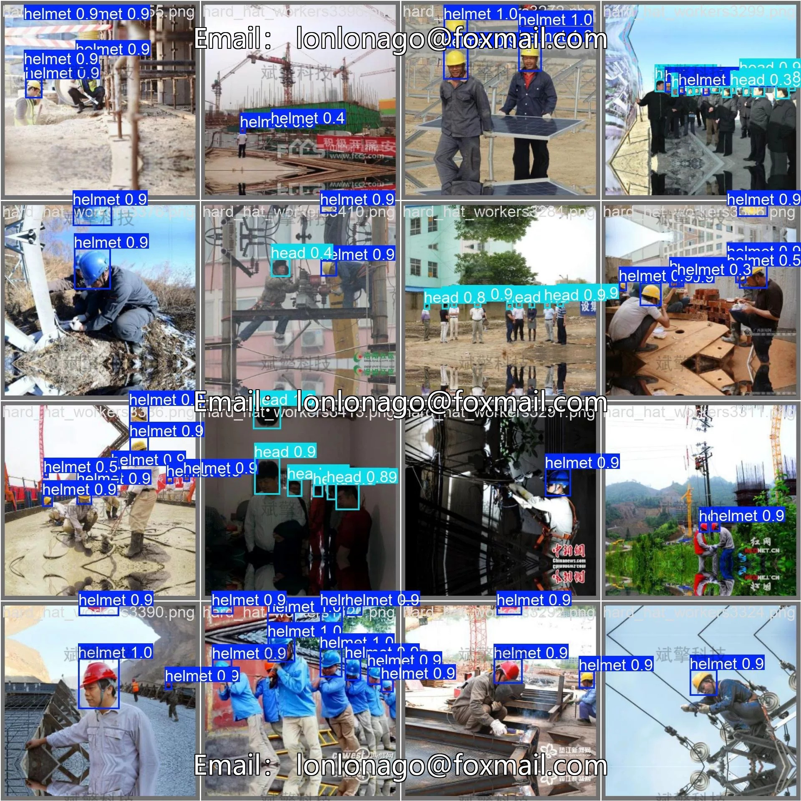

# YOLOv26 Safety Helmet Recognition Detection System | Model

## Body

This research report is based on the YOLO26 object detection algorithm and has built a smart recognition system for the wearing of safety helmets in construction sites. The system targets the needs of safety supervision in high-risk environments such as construction, achieving real-time detection and recognition of the wearing status (helmet) and head (head) of the workers. The study adopts a dataset containing 5000 labeled images (3500 training set, 750 validation set, and 750 test set), which are trained and optimized through the YOLO26 model.
The experimental results show that the model achieves an mAP@0.5 metric of 0.944, with precision and recall both at 0.96, demonstrating excellent detection performance. The confusion matrix analysis shows that the model has a recognition accuracy of 93% for the category of safety helmets and 87% for the category of head, but there is a 30% misjudgment of the head to be a safety helmet. The overall performance of the system is good, which can effectively assist in the safety supervision work in construction sites, reduce the cost of manual inspections, and improve the efficiency of safety management.
The dataset contains two target categories:
helmet (safety helmet): including various colors (red, yellow, blue, white, etc.), styles, and wearing states of safety helmets
head (head): refers to the head without wearing a safety helmet, including various angles, postures, and obstructions

## Images

## Payment

Here is a pay link on Stripe ( https://buy.stripe.com/3cs8yP7sY87d0vu9AB ). Please contact me lonlonago@foxmail.com after funding $89, and I will send you a complete data files , thank you!

